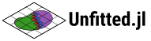

<p align="center">
  <picture>
    <source media="(prefers-color-scheme: dark)" srcset="resources/logo-dark.svg">
    
  </picture>
</p>

> [!WARNING]
> **Early development.** Unfitted.jl is under active development and has not
> had a stable release yet. The public API, default values, and numerical
> conventions can change between commits without prior notice. Pin a specific
> commit if you need reproducibility, and review the diff before updating.

A compact, dimension-generic Julia implementation of **unfitted multi-level
hp refinement** on axis-aligned Cartesian grids, with **selective per-cell
activation** and **finite-cell-method (FCM) immersed-boundary integration**
via non-negative moment-fit quadrature.

## Method reference

The method is described in

> J. N. Schmäke and M. Ruess, *Unfitted Multi-Level hp Refinement for
> Localized and Moving Solution Features*, arXiv preprint
> [arXiv:2604.25797](https://arxiv.org/abs/2604.25797).

## What's in the package

- **Unfitted multi-level hp refinement** on tensor-product Cartesian
  meshes via the superposition of independently discretized levels
  (base + overlays). Unlike the *fitted* multi-level hp method
  (Zander et al., as implemented and extended by Kopp et al. CMAME
  **401** (2022) 115575), this package neither topologically merges
  overlays with their parents nor introduces hanging-node
  constraints; every overlay imposes homogeneous Dirichlet data on
  its artificial boundary `Γ_o^(k) = ∂Ω^(k) \ ∂Ω` instead. The
  default basis family is hierarchical integrated Legendre; an
  open-knot tensor-product B-spline family is available through the
  `BasicBSpline.jl` package extension (load `BasicBSpline` alongside
  `Unfitted` and pass `basis = bspline()`). That family keeps the
  functions whose whole support lies inside a level's active region, so
  the **superposition** is `C^(p−1)` and not merely each level — under
  any activation pattern, with no constraint equation and no restriction
  on the shape of the mask. Worked through in
  [`examples/tutorials/04_bspline/`](examples/tutorials/04_bspline).
- **Selective per-cell activation** with the `move!`-style invalidation
  contract; useful for transient problems where small-scale features
  evolve in time. Overlays, masks and the invalidation contract are
  worked through in
  [`examples/tutorials/02_overlays/`](examples/tutorials/02_overlays).
- **Immersed-boundary integration** through a `PhysicalDomain` carrying a
  CSG level set of smooth leaves (`leaf`/`intersect`/`union`/`setdiff`/
  `complement`). Cells outside `Ω` are dropped from the dof layout; cells
  crossed by `∂Ω` use a non-negative moment-fitted quadrature rule whose
  moments come from Saye's exact implicit quadrature, with the moment-fit
  structure informed by QuESo (see [`NOTICE.md`](NOTICE.md) for upstream
  attribution). The level set need not be a formula: a closed segment loop
  or triangle surface becomes a signed-distance leaf through
  `mesh_levelset` / `stl_levelset` in the `FileIO` + `MeshIO` extension.
  See [`examples/tutorials/03_immersed_fcm/`](examples/tutorials/03_immersed_fcm)
  for the analytic route and
  [`examples/applications/imported_geometry_3d/`](examples/applications/imported_geometry_3d)
  for the imported one.
- **Multi-domain coupling**: fields may live on *independent* spaces —
  each subdomain with its own mesh, level-set fold and dof block — tied
  together across a shared interface mesh by `couple(uₐ, u_b, Γ, form)`.
  A `WeakForm` gives the jump coupling `∫_Γ a(⟦u⟧, ⟦v⟧) dΓ`, expanded
  into the four field blocks with the `+ − − +` sign pattern; an
  `InterfaceForm` kernel — reading `q.normal`, the current side's
  `trial` gradient (with `sides` naming which side that is), both
  coupled fields through `q.state`, and the `onside` / `jump_sign`
  helpers — expresses any two-sided law (weighted Nitsche, cohesive,
  flux-weighted); `couple` instantiates that kernel once per side pair,
  so the two-sidedness spans the four blocks. The package supplies the
  two-sided interface integration, never the constitutive choice.
  `foreach_quadrature_point(f, model; on = iface, state)` walks the
  interface's points under the `q.point` numbering the coupling forms see,
  the key for per-point history such as a cohesive damage state. An
  `Interface` matches by identity, so walk with the one the coupling
  carries (`iface = first(blocks).on` for the `blocks = couple(…)` given
  to the problem), whose points `prepare` already resolved, or build one
  `interface(uₐ, u_b, Γ)` and reuse it: every new `Interface` object
  intersects Γ with both grids again.
- **Leaf semantics on covered regions**: a cell carries basis functions
  only where no finer level has taken the region over. Every high-order
  mode whose entire incidence stencil is covered by a finer level is
  eliminated, leaving the linear skeleton.
  Elimination is per-mode rather than per-cell — a mode is shed only
  when every cell it touches is covered, so an edge or face mode
  straddling the boundary of the covered region survives — and a buried
  linear mode that a *nested* finer level reproduces exactly is
  deduplicated. Coverage is mask-aware — a user-deactivated overlay cell
  does not cover, so a fully deactivated overlay still behaves like no
  overlay — while a cell folded away as fictitious does cover, because
  it carries no material. Shedding high-order modes is
  integrated-Legendre only; the deduplication also runs on a B-spline
  level, where it is what keeps a nested stack non-singular rather than
  an accuracy trade — the duplicate it removes is reproduced exactly by
  the level above. `diagnostics(model, solution).reduced_mode_counts`
  reports the count per level, concatenated field-by-field. There is
  nothing to configure: `prepare(problem; prune = false)` builds the
  unreduced twin, which is a diagnostic — exactly singular on a nested
  stack — rather than a discretisation to solve with.
- **Per-cell polynomial order** (integrated Legendre only; any other
  family raises rather than ignoring a non-uniform field): `space` and
  `overlay` take `order` as an integer, an `NTuple{D,Int}`, an array
  shaped like the level's cell grid, or a predicate
  `(cell_box, cell_index) -> order`. `elevate(V, level => order)` and
  `elevated(model, …)` change it afterwards — including
  `CartesianIndex => order` pairs, the shape a marking loop produces —
  and `cell_orders(V; level)` reads it back. Where two cells of
  different order share a face the shared entity carries the minimum of
  the two, which is what keeps the space C⁰.
- **Nested refinement ladders**: `ladder(domain; cells, order, depth,
  splits)` declares a stack of aligned levels that arrives inert, so
  every level nests over every level below it by construction.
  `adapt(V, level => mask, …)` or `adapt(V, depths; grade)` switches
  cells on per level in one rebuild, `adapted(model, V)` prepares the
  result, and `is_nested` / `overlapping_cells` query the stack. Worked
  through in
  [`examples/tutorials/05_ladders/`](examples/tutorials/05_ladders).
- **Automated hp adaptivity**: `estimate(model, u)` is a Bank–Weiser
  indicator carrying a scale-free stopping quantity; `refine(V, est;
  theta, previous)` marks by Dörfler and, given
  `previous = (V_last, est_last)`, sends each marked cell to h or to p
  by Melenk–Wohlmuth predicted error reduction — omit `previous` and
  every marked cell takes p, falling back to h only where p is
  unavailable; `coarsen` reverses both steps.
  [`examples/tutorials/06_adaptive_hp/`](examples/tutorials/06_adaptive_hp)
  introduces the loop, and
  [`examples/reproductions/adaptive_tanh_layer_2d/`](examples/reproductions/adaptive_tanh_layer_2d)
  is the measured protocol that threads `previous`.
- **D-generic core**: 1D, 2D, 3D, and 4D smoke-tested.

## Installation

Unfitted.jl is not yet registered. Add it directly from the repository:

```julia
import Pkg
Pkg.add(url="https://github.com/schmaeke/Unfitted.jl")
```

Julia 1.10 or newer is required.

## Quick example

Poisson on a square plate with a circular hole. The plate's outer edge is a
face of the background box and carries a Dirichlet condition; the hole is
immersed — the mesh knows nothing about it — and is left free.

```julia
using Unfitted

# The background box. It is meshed regardless of the geometry, which is what
# makes the method unfitted: cells may be inside Ω, outside it, or cut by ∂Ω.
omega = box((-1.0, -1.0), (1.0, 1.0))

# Ω = { x : φ(x) ≤ 0 } ∩ omega, so this φ keeps the square *minus* a disk of
# radius 0.7. `lipschitz = 1` certifies φ as a signed distance, which lets the
# quadrature kernel skip subdivision it can prove unnecessary;
# `subcell_length_scale` is the geometric resolution for cells it cannot.
plate = physical_domain(x -> 0.7 - sqrt(x[1]^2 + x[2]^2); lipschitz=1.0,
                        subcell_length_scale=0.02)

# 16×16 cells of quadratic integrated Legendre. Cells wholly outside Ω are
# dropped; cut cells get a non-negative moment-fitted rule instead of tensor
# Gauss. `u` is the unknown field on that space — scalar unless you ask for
# components.
V = space(omega; cells=(16, 16), order=2, physical=plate)
u = field(:u, V)

# The weak form, assembled term by term: `blocks` are bilinear (here ∫ ∇u·∇v),
# `loads` are linear (∫ f v with f ≡ 1), and `dirichlet` is imposed strongly by
# eliminating the constrained dofs rather than by penalty.
problem = Problem((u,);
                  blocks    = (stiffness_block(u),),
                  loads     = (source_load(u; source = 1.0),),
                  dirichlet = [dirichlet(0.0; on=boundary(:all))])

# `prepare` does the geometry once — classify cells, build integration regions
# and cut-cell rules, number the dofs, resolve constraints. `solve!` assembles
# and factorises. `report` carries the numbers you need to trust the run:
# active unknowns, cut-region and fit-failure counts, residual norm.
model    = prepare(problem)
solution = solve!(model)
report   = diagnostics(model, solution)

# A ParaView bundle: `plate.vtm` and its pieces. The field is sampled on a
# subdivided grid, since a p = 2 basis is not linear across a cell. The mesh
# itself is written as whole cells carrying an `active` flag — cut cells are
# not clipped — so the hole reads as the 76 of 256 cells the fold dropped.
write_vtk("plate", solution, model)
```

`boundary(:all)` selects faces of the background box `omega`, which here are
genuine material boundary, so the condition constrains 128 of the 824 raw
degrees of freedom. That distinction matters as soon as the geometry moves
inside the box: had `Ω` been the disk itself rather than the plate around it,
those same faces would lie entirely in the fictitious region and the identical
line would have constrained nothing, silently. A condition on an immersed
surface is a different construction — approximate it as a `BoundaryMesh` and
impose the datum weakly with a Nitsche term, as
`tutorials/03_immersed_fcm/` does on both rims of an annulus.

`examples/` is organised in three tiers, which answer three different
questions. **Tutorials** teach the API and are meant to be read in order.
**Applications** are recognisable engineering problems solved plainly, and are
where the package is shown working alongside third-party Julia packages.
**Reproductions** are the scientific record — the benchmarks behind the method
paper at their published configurations, the FCM moment-fit reproductions, and
the adaptivity benchmark scored against deal.II's step-27.

Each example lives in its own sub-directory with a self-contained
`Project.toml` (Unfitted is wired in via `[sources]`), so example-specific
dependencies stay out of the package's own `Project.toml`. Run any example
with

```bash
julia --project=examples/<tier>/<name> examples/<tier>/<name>/<name>.jl
```

`Manifest.toml` is git-ignored, so the first run of an example resolves and
installs that example's own dependencies. Most resolve in seconds;
`applications/time_integration` pulls in the `OrdinaryDiffEq.jl` tree and takes
a few minutes the first time.

### Tutorials — start here

| Sub-directory | What it teaches |
|---|---|
| `tutorials/01_first_solve/` | The whole workflow in seven calls: `box → space → field → poisson → prepare → solve! → diagnostics`, first on an interval and then, unchanged, on a square |
| `tutorials/02_overlays/` | Local refinement by superposition: adding an overlay, masking it to a patch, `activate!`/`deactivate!`, and reading `reduced_mode_counts` |
| `tutorials/03_immersed_fcm/` | Geometry the mesh knows nothing about: a CSG level set, cut-cell moment-fit quadrature, and a Nitsche condition on an immersed boundary |
| `tutorials/04_bspline/` | Swapping the basis family to B-splines, why a nested B-spline stack needs deduplication, and B-splines on an immersed domain |
| `tutorials/05_ladders/` | Why a finer overlay can be less accurate, declaring a nested stack with `ladder`, and switching its cells on per level with `adapt` |
| `tutorials/06_adaptive_hp/` | Handing the refinement decision to the solver: `estimate`, `refine`, and how the loop picks h against p from a cell's own refinement history |

### Applications — the package on real problems

| Sub-directory | What it solves |
|---|---|
| `applications/kirsch_plate_2d/` | Plane-stress plate with a circular hole, verified against the Kirsch solution; the weak form is written in `Tensors.jl` notation |
| `applications/interface_coupling_2d/` | Bonded bi-material joint: two independently meshed subdomains tied across a shared seam by a weighted Nitsche interface form |
| `applications/imported_geometry_3d/` | Heat conduction in a non-convex L-bracket whose geometry arrives as a triangle surface mesh (`FileIO` + `MeshIO`) rather than as a formula |
| `applications/time_integration/` | Transient heat conduction where Unfitted supplies `M`, `K` and `f` once and `OrdinaryDiffEq.jl` owns the time axis |
| `applications/thermal_curing_2d/` | Irreversible thermal curing of a thermoset: the cure fraction is per-quadrature-point `QuadField` state, the conductivity depends on it (Picard per step), and the overlay activates on the cure front — with `RBFP0` carrying the state across every rebuild |

### Reproductions — the scientific record

| Sub-directory | What it pins |
|---|---|
| `reproductions/laplace_unit_square_smooth/` | Smooth Laplace verification on the unit square |
| `reproductions/singular_square_2d/` | 2D corner-singularity convergence with nested overlays |
| `reproductions/conditioning_small_overlap/` | Small-overlap conditioning sweep, one CSV row per (order, overlap) |
| `reproductions/traveling_laser_2d/` | Moving Gaussian laser: automated hp adaptivity on a transient, against an exact convolution reference |
| `reproductions/adaptive_tanh_layer_2d/` | Automated hp on a curved interior layer, scored on a fixed background lattice against deal.II step-27 |

## Documentation

Source files are the primary documentation. Every public symbol carries a
docstring; non-trivial internal helpers carry leading comment blocks
explaining the math, the algorithmic choices, or both.

For project goals, mathematical contracts, code style, testing standards,
and the contributor / PR workflow, see
[`CONTRIBUTING.md`](CONTRIBUTING.md).

## Citing

If you use Unfitted.jl in academic work, please cite the method paper:

> J. N. Schmäke and M. Ruess, *Unfitted Multi-Level hp Refinement for
> Localized and Moving Solution Features*, arXiv:2604.25797.

A machine-readable record is available in
[`CITATION.cff`](CITATION.cff).

## License and attribution

Unfitted.jl is distributed under the MIT License (see [`LICENSE.md`](LICENSE.md)).

The non-negative moment-fit structure in `src/fcm.jl` is informed by
[QuESo](https://github.com/manuelmessmer/QuESo) (BSD-4-Clause), used as an
algorithmic reference only (no code vendored); the cut-cell moments come
from Saye's implicit quadrature. See [`NOTICE.md`](NOTICE.md) for the full
upstream attribution.
